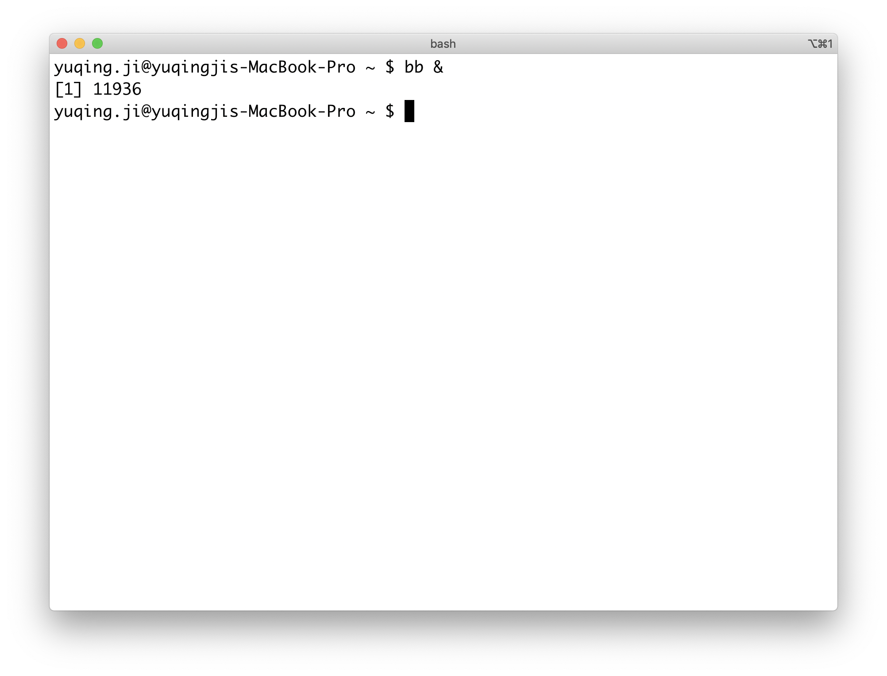

Timer is almost a necessary in my daily life. 
Once noticed I can't focus, I would set a timer then ask myself to get something specific done within the time - to calm down and kick myself into the flow.

I failed to find an explicit timer in MacOS by default. 
Reminders, Calendar, etc. could be choices but timer is not their main feature.
I could also use a 3rd party application, a real timer, or phone, but in most cases I am lazy to interact with them, which always require more than 3 steps for a timer setup. 
So I wrote [brainbreak](https://github.com/vjyq/brainbreak). 

brainbreak makes me set a timer via command line in one step:
```
$ bb &
```



The output is the process id. brainbreak process would run in detached and there would be a voice alert until time's up. I made it 1 min but you could customize it as you want. No coding required, just:
```
$ bb -c <your-interval> &
```

The interval unit is the second. To get brainbreak, see [README](https://github.com/vjyq/brainbreak). 

<div style="border-top:1px solid #e1e4e8;padding-top:16px"></div>
<div>© 2018-2020 by YUQING JI</div>
<div style="padding-top:0.3em"><a href="https://vjyq.github.io/en/">Blog</a> | <a href="mailto:yuqing.ji@outlook.com">Email</a> | <a href="https://github.com/vjyq">Github</a></div>